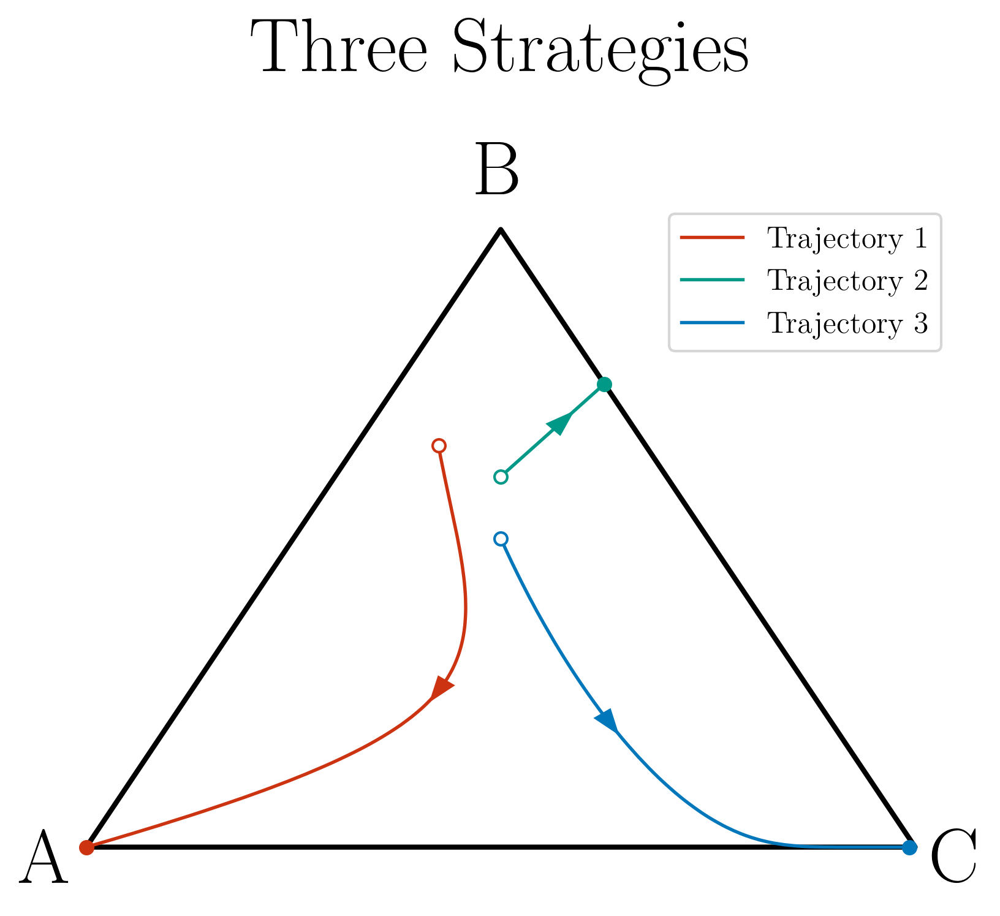

# Ternary plots

This script uses matplotlib to plot ternary trajectories that usually appear in the field of evolutionary game theory.

---

### **Overview**

This script is a tool I developed to plot graphs for my master's degree. I wrote the code to be easily importable and reusable, allowing me to use it in other projects without making changes to the original file. I've polished it a bit and am now sharing it in case it's useful to others.

_Note_: I am not a professional Python developer. I cannot guarantee that the script will work in all situations, so please use it at your own risk.

---

## **How to use it**

You're welcome to use the script as it is, but if you just need some simple plots and want to avoid diving into the code, you can simply import it and use the methods I'll describe below

#### **Prerequisites**

* matplotlib

### Example ###
Let's suppose we have three files, each one of them containing a trajectory. The plot could be written like this:
<pre>
import ternaryplot as tp

tp.set_axis(("A", "B", "C"))
tp.set_title("Three Strategies")

tp.plot("data1.txt", 
        show_arrow = True, 
        arrow_pos = 45, 
        line_color = "#CC3311", 
        label = "Trajectory 1")

tp.plot("data2.txt", 
        show_arrow = True, 
        arrow_pos = 20, 
        line_color = "#009988", 
        label = "Trajectory 2")

tp.plot("data3.txt", 
        show_arrow = True, 
        arrow_pos = 25, 
        line_color = "#0077BB", 
        label = "Trajectory 3")

tp.show_legend(font_size = 12)
tp.save("image.png")
tp.show()

</pre>

which produces the output

<figure style = "text-align : center;">

<figcaption>Three different trajectories of a Rock-Paper-Scissors Game.</figcaption>
</figure>

## The "Documentation" ##
### `set_title(str)` (optional)
If called sets the title of the plot to the argument passed. No title is displayed otherwise.

### `set_axis(tuple, **kwargs)` (mandatory)
Set the triangular axis.

**Parameters:**

* A 3-dimensional `tuple`  of `strings` indicating each strategy. The order is important. (Mandatory)

* `**kwargs`:

    * `triangle_color` (`str`, optional):
        * The color of the triangular axis.
        * **Default**: `'black'`.

    * `triangle_line_width` (`float`, optional):
        * The thickness of the lines of the triangular axis.
        * **Default**: `2`.

    * `left_label_xpos` (`float`, optional):
        * The horizontal position of the left corner label.
        * **Default**: `0`.

    * `top_label_xpos` (`float`, optional):
        * The horizontal position of the top corner label.
        * **Default**: `0`.

    * `right_label_xpos` (`float`, optional):
        * The horizontal position of the right corner label.
        * **Default**: `0`.

    * `left_label_ypos` (`float`, optional):
        * The vertical position of the left corner label.
        * **Default**: `0`.

    * `top_label_ypos` (`float`, optional):
        * The vertical position of the top corner label.
        * **Default**: `0`.

    * `right_label_ypos` (`float`, optional):
        * The vertical position of the right corner label.
        * **Default**: `0`.

* 
### `plot(*args, **kwargs)`

**Parameters:**

* `*args`:
    * Receives the input data for plotting.

    **If `*args` contains three `lists` or three `ndarrays` (numpy arrays)**
    * **Input:** Three arrays (x, y and z) each one of them respective to one of the three strategy frequencies. Such that x[t], y[t] and z[t] indicate the strategy frequencies at time t.
    * **Behavior:** Plot the data within the file.    

    **If `*args` contains a single `string`**
    * **Input:** A text file in the same directory as the script with name as the `string`. The file data must be in three columns each one of them pertaining to the value of each strategy frequency at a given instant.
    * **Behavior:** Plot the data within the file.

    One of these inputs are **required**!

* `**kwargs`:
    * `line_color` (`str`, optional):
        * The color of the line.
        * **Default**: `'black'`.

    * `line_width` (`float`, optional):
        * The thickness of the line.
        * **Default**: `1.3`.

    * `label` (`str`, optional):
        * A text label to be displayed in the legend.
        * **Default**: `''` (an empty string).

    * `arrow_head_width` (`float`, optional):
        * The width of the arrow head. 
        * **Default**: `0.025`.

    * `show_arrow` (`bool`, optional):
        * If `True`, an arrow head will be displayed.
        * **Default**: `False`.

    * `arrow_pos` (`float`, optional):
        * The position of the arrow head along the line, specified by a coordinate of the data relative to a position of the array.
        * **Default**: `0` (the start of the line).

    * `show_start_marker` (`bool`, optional):
        * If `True`, a marker will be shown at the start of the line.
        * **Default**: `True`.

    * `show_end_marker` (`bool`, optional):
        * If `True`, a marker will be shown at the end of the line.
        * **Default**: `True`.

### `show_legend(**kwargs)`
Show the legend of the plot. It will not be displayed otherwise.

**Parameters:**

* `**kwargs`:
    * `font_size` (`float`, optional):
    * The size of the font.
    * **Default**: `16`.

### `save(string, **kwargs)`
Saves the image in the directory.

**Parameters:**
* A single `string` used as the file name. It does not have to include the format. All images are saved as `.png`.

* `**kwargs`:
    * `dpi` (`int`, optional):
    * The `dpi` of the image.
    * **Default**: `300`.

### `show(string, **kwargs)` (mandatory)
Shows plot.
